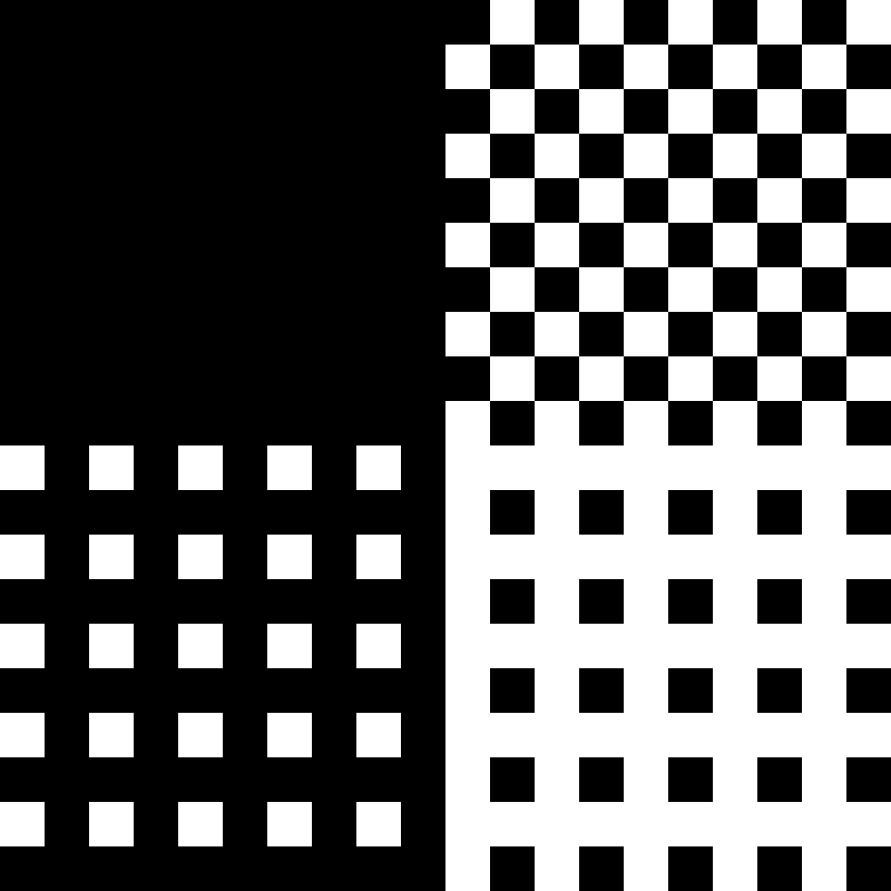

.. agh-mirosot-vision documentation master file, created by
   sphinx-quickstart on Tue Sep 27 20:57:37 2011.
   You can adapt this file completely to your liking, but it should at least
   contain the root `toctree` directive.

.. highlight:: c

.. toctree::

Dokumentacja interfejsu
-----------------------

Ze względu na wymagania dotyczące wydajności i konieczność współpracy z 
maksymalnie różnorodnymi środowiskami algorytm rozpoznawania robotów został
zaimplementowany jako program w języku C++ z interfejsem w C. Taka konfiguracja
zapewnia maksymalną kompatybilność z dowolnym językiem programowania.

Cała istota algorytmu jest zawarta w jednej funkcji:

.. c:function:: robot_data find_teams(mirosot_vision_config* config)

    Przyjmuje ona dane wizualne i tworzy opis drużyn robotów.
    
    Struktury z tej funkcji intensywnie korzystają ze struktury opisującej
    położenie punktu na płaszczyźnie bitmapy.

.. c:type:: struct image_pos

    ::
        
        struct image_pos {
            int x;
            int y;
        };
    

Konfiguracja
************

.. c:type:: struct mirosot_vision_config

    ::

        struct mirosot_vision_config {
            unsigned char* image;
            int height, width;
            
            image_pos* white_points;
            int white_points_len;
            
            image_pos* mask_points;
            int mask_points_len;

            double px_per_cm;
            double robot_size;
            
            int meanshift_radius;
            int meanshift_threshold;

            int black_cutoff;
            int blue_min;
            int blue_max;
            int yellow_min;
            int yellow_max;
            int minimum_saturation;
            int white_cutoff;
            char linearize;

            unsigned char *debug_balance;
            unsigned char *debug_prescreen;
            unsigned char *debug_meanshift;
            unsigned char *debug_patches;
            unsigned char *debug_robots;
            void* state;
        };

    Strukturę należy zainicjalizować funkcją ``init_config``, która wypełnia 
    pola wartościami domyślnymi i przygotowuje zawartość tablic pomocniczych 
    ukrytych w polu ``state``.

Poniżej opisane są poszczególne elementy struktury.

bitmapa
^^^^^^^

Struktura wejściowa zawiera wskaźnik do obrazka, z którego ma zostać wyciągnięta 
informacja o robotach. Dane koloru pikseli bitmapy są zapisane jako 3 bajty w 
formacie BGR, czyli dla wskaźnika ``unsigned char* ptr``::

    B = ptr[0];
    G = ptr[1];
    R = ptr[2];

Wartości pikseli obrazka na współrzędnych x i y są określone wzorem 
``img(x, y) = img_ptr[3*(x + y*width)]``, czyli piksele są upakowane ciasno 
w przestrzeni adresowej i są przechowywane wierszami.

Alokacją obrazka zajmuje się użytkownik. 
**Zawartość bitmapy zostaje zamazana po wywołaniu find_teams**

inicjalizacja
^^^^^^^^^^^^^
   Przed pierwszym użyciem należy skonfigurować pewne informacje o świecie
   i warunkach oświetleniowych. Dane na temat samego wyglądu patcha na robocie
   są aktualnie hardcodowane. 

.. c:member:: double mirosot_vision_config.px_per_cm
.. c:member:: double mirosot_vision_config.robot_size

    Podają odpowiednio rozdzielczość obrazu na powierzchni boiska (w pikselach
    na centymetr) i długość boku robota w centymetrach.

.. c:member:: char mirosot_vision_config.linearize

    Wartość logiczna określająca, czy przed wszystkimi innymi operacjami ma 
    zostać wykonana konwersja kolorów z sRGB do liniowego RGB.

.. c:member:: image_pos *mirosot_vision_config.white_points
.. c:member:: int *mirosot_vision_config.white_points_len

    Pozycje punktów boiska, które można określić jako białe. Służą do balansu 
    bieli na obrazku.

.. c:member:: image_pos *mirosot_vision_config.white_points
.. c:member:: int *mirosot_vision_config.white_points_len

    Wierzchołki wielokąta opisującego region zainteresowania. Piksele spoza tego
    wielokąta są maskowane kolorem czarnym. Maskowanie następuje po balansie 
    bieli.

.. c:member:: int mirosot_vision_config.meanshift_radius
.. c:member:: int mirosot_vision_config.meanshift_threshold

    Rozmiar okna algorytmu wygładzania powierzchni meanshift i odległość 
    obcięcia koloru. Rozmiar okna może mieć duży wpływ na wydajność.
    Im większe okno, tym większy obszar jest brany pod uwagę przy wygładzaniu.
    Threshold to odległość w normie euklidesowej pikseli, które są uważane za 
    różne.

.. c:member:: int mirosot_vision_config.yellow_min
.. c:member:: int mirosot_vision_config.yellow_max
.. c:member:: int mirosot_vision_config.blue_min
.. c:member:: int mirosot_vision_config.blue_max

    Zakresy wartości barwy (Hue), w których znajdują się żółte i niebieskie 
    patche robotów.

.. c:member:: int mirosot_vision_config.minimum_saturation

    Minimalne nasycenie koloru będącego częścią obszaru żółtego lub 
    niebieskiego.

.. c:member:: int mirosot_vision_config.black_cutoff

    Minimalna jasność (Lightness) piksela mogącego być przetworzonym. 
    Ciemniejsze piksele są ignorowane.

.. c:member:: int mirosot_vision_config.white_cutoff

    Jasność, przy której piksel uważa się za prześwietlony. Algorytm zakłada, że
    żółte obszary mają tendencję do prześwietlania i traktuje takie obszary 
    jako żółte.

.. c:member:: unsigned char *debug_balance.debug_balance
.. c:member:: unsigned char *debug_balance.debug_prescreen
.. c:member:: unsigned char *debug_balance.debug_meanshift
.. c:member:: unsigned char *debug_balance.debug_patches
.. c:member:: unsigned char *debug_balance.debug_robots

    Jeśli któreś z tych pól zostanie ustawione na bufor zaalokowany przez
    użytkownika, zostanie on wypełniony kopią obrazka z pola image z 
    domalowanymi elementami mogącymi wspomóc diagnozowanie problemów z 
    algorytmem.

Wynik działania
***************

.. c:type:: struct vision_data
    
    Kontener na dane o drużynach i piłce. Zawartość struktur wydaje się być 

    ::
        
        struct vision_data {
            team_data blue_team;
            team_data yellow_team;
            image_pos ball_pos;
        };
        
        struct team_data {
            int team_len;
            robot_data team[MAX_ROBOTS];
        };

        struct robot_data {
            image_pos position;
            double angle;
        };

Opis algorytmu
--------------

1. Linearyzacja
***************

Najbardziej popularny sposób kodowania kolorów w kamerach i innych urządzeniach
przetwarzania obrazu to nieliniowo kodowana przestrzeń sRGB. Aby powiązać 
wartość liczbową piksela z fizyczną energią światła, wartość piksela należy
zlinearyzować. 

2. Regulacja balansu bieli.
***************************

Wiedząc, że pomalowany na biało przedmiot posiada kolor :math:`(w_r, w_g, w_b)`,
bardzo łatwo przekolorować bitmapę, by biały wyglądał na biały. Wystarczy 
dla każdego piksela :math:`p` zastosować prostą transformację: 

.. math::
    (p'_r, p'_g, p'_b) = (p_r\cdot\frac{255}{w_r}, p_g\cdot\frac{255}{w_g}, p_b\cdot\frac{255}{w_b})
    
Jeśli :math:`w`, czyli punkt bieli jest znany i taki sam, na tym można zakończyć
balans. Co jednak, jeśli punkt bieli jest różny w różnych punktach obrazu?
Wtedy w każdym punkcie obrazu (tak naprawdę na każdym małym kafelku obrazu) 
wyznaczamy punkt bieli jako średnią ważoną wagą :math:`\frac{1}{r^2}`, 
gdzie :math:`r` to odległość punktu z bielą do badanego punktu.

3. Transformacja do HSV
***********************

Obok obrazka w formacie RGB tworzony jest jego odpowiednik HSV.

4. Wstępne zaznaczanie kandydatów
*********************************

Piksele, które wpadają w odpowiedni przedział barwy (H) i nasycenia (S) są 
oznaczane jako kandydaci do dalszego przetwarzania w zbiorach pikseli żółtych i 
niebieskich. 

5. Meanshift
************

Algorytm segmentacji meanshift posiada wstępną fazę filtrowania, która wygładza
jednolite obszary, tak że po filtrowaniu stanowią jeden jednolity kolor. 
Istotę tego filtrowania można stosować do każdego piksela z osobna. Dzięki temu,
że po filtrowaniu jednokolorowe obszary są bardzo jednolite, można je wyodrębnić
za pomocą zwykłego algorytmu flood-fill.

6. Obszary
**********

Następnie obszary są segregowane na podstawie ich rozmiaru. Za duże lub za małe
obszary są odrzucane.

7. Regresja
***********

Na wyodrębnionych obszarach wyznaczana jest linia minimalizująca
sumę kwadratów odległości pikseli od linii (regresja Deminga). Za jej pomocą
wyznaczamy kąt obrotu robota. Proste policzenie ilości pikseli patcha pozwala na
odróżnienie obrotów różniących się od siebie o :math:`180^\circ`.
